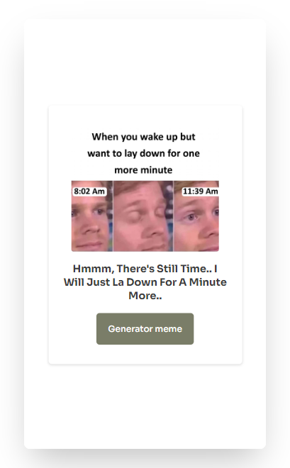

  
  
  
  
  
 
  <h2 align="center">Meme Generator</h2>
  It generates a random meme from the D3vb Meme API scraping various subreddits in reddit.

  <a href="https://mde3.github.io/Temperature-Converter/"><strong>➥ Live Demo</strong></a>
  

  

